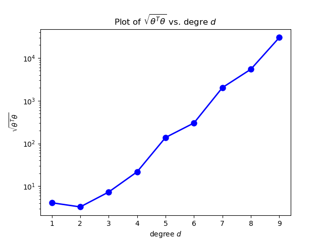

# Linear Regression and Gradient Descent

1. Solving a linear regression via gradient descent for ‘d’ dimensional input and N samples using individual parameter updates
(theta_i's) in a non-vectorised setting.\
  Method should include: \
    a. learning rate, default: 0.01 \
    b. number of iterations (default: 100) \
    c. Learning rate function over time: \
      (i) ‘Constant’: (default)learning rate does not change over time \
      (ii) ‘Inverse’: learning rate is alpha/t where t is the iteration number \
    d. Batch_size (setting it to 1 converts to SGD, setting to some number between 1 and N converts to mini-batch GD. 
     Edit `linearRegression/linearRegression.py (fit_non_vectorised())` 

The code `linearRegression/linearRegression.py  fit_non_vectorized()` was written, it gives the value of linear regression coefficients for the features using the samples provided for given parameters - batch_size, number of iterations, learning rate coefficient,etc. using non vectorized method, i.e., calculating gradients for each coefficient for each sample in loop to get aggregate gradient descent for each coefficient and then updating the coefficients based on the gradient and learning rate. 

On running the code `q1_q2_q3_test.py` for an input of 30 samples and 5 features of random values for batch size of 10, 100 iterations and a constant learning rate of 0.01, for fit_intercept=*True* we get mean absolute error as 2.077 and for fit_intercept=*False* we get mean absolute error as 2.679. 

The error has increased when there is no bias term.

2. Solving the above using gradient descent in vectorised form with all the same set of parameters. Edit `linearRegression/linearRegression.py (fit_vectorised())` 

The code `linearRegression/linearRegression.py  fit_vectorized()` was written, it gives the value of linear regression coefficients for the features using the samples provided for given parameters - batch_size, number of iterations, learning rate coefficient,etc. using vectorized formula, i.e., 
```math
\theta = \theta - \alpha*(2/n_samples)*(X^T X \theta -X^T y )
```

On running the code `q1_q2_q3_test.py` for an input of 30 samples and 5 features of random values for batch size of 10, 100 iterations and a constant learning rate of 0.01, for fit_intercept=*True* we get mean absolute error as 1.09 and for fit_intercept=*False* we get mean absolute error as 1.2. 

The error has increased when there is no bias term. Also, the vectorized format seams to be producing less error as compared to non_vectorized method.

3. Write a function to learn the regression coefficients using gradient descent. Instead of writing the formulae for computing gradients by yourself, you will use JAX/Tensorflow/PyTorch to automatically do that for you. All other parameters remain the same. Edit `linearRegression/linearRegression.py (fit_autograd())` 

The code `linearRegression/linearRegression.py  fit_autograd()` was written, it gives the value of linear regression coefficients for the features using the samples provided for given parameters - batch_size, number of iterations, learning rate coefficient,etc. using autograd library's elementwise_grad to calculate gradient vector for the coefficents and then updated them using this gradient.


On running the code `q1_q2_q3_test.py` for an input of 30 samples and 5 features of random values for batch size of 10, 100 iterations and a constant learning rate of 0.01, for fit_intercept=*True* we get mean absolute error as 0.99 and for fit_intercept=*False* we get mean absolute error as 1.67. 

The error has increased when there is no bias term. Also, the autograd format with bias term seams to be producing less error as compared to vectorized implementation.

4. Writing a function inspired by sklearn’s polynomial preprocessing: (https://scikit-learn.org/stable/modules/generated/sklearn.preprocessing.PolynomialFeatures.html) your function should have: degree and include bias parameters only. For this assignment, assume that input is a 1-dimensional numpy array.  For example, if an input sample is  np.array([a, b]), the degree-2 polynomial features with "include_bias=True" are [1, a, b, a<sup>2</sup>, b<sup>2</sup>].Edit
`preprocessing/polynomial_features` 

The code `preprocessing/polynomial_features.py` was written, it gives the higher degree polynomial of input. 

On running the code `q4_pf_test.py` for an input of `X=[1,2]` having two feature with maximum degree = 2 and include_bias=True the following output is returned. 

```
[[1. 1. 2. 1. 4.]]

5. Creating a data set as follows: 
```python
x = np.array([i*np.pi/180 for i in range(60,300,4)]) 
np.random.seed(10) #Setting seed for reproducibility 
y = 4*x + 7 + np.random.normal(0,3,len(x)) 
```
Now, using the newly created function for polynomial feature generation above, ploting magnitude of theta v/s degree when, fitted with
linear regression using the polynomial of degree d. What can you conclude? Edit `q5_plot.py` 

```python
x = np.array([i*np.pi/180 for i in range(60,300,4)]) 
np.random.seed(10) #Setting seed for reproducibility 
y = 4*x + 7 + np.random.normal(0,3,len(x)) 
```

A dataset was generated using the above code. A scatter plot of the data is shown below :.

<p align="center">
    
</p>

Using the function for polynomial feature generation a plot of magnitude of theta v/s degree was generated. 


<p align="center">
    
</p>

From the above plot it can be observed that as the degree is incresed the magnitude to theta is also incresing. This is expected as we are not doing regularization in this linear regression. Therefore on incresing degree the model tries to fit more and more training data and in that the magnitude of theta increases.

6. Using the above code and for degree = 1, 3, 5, 7, 9, plot magnitude of theta v/s degree for varying N, where N is the size of
the data set (size of x, and thus y). What can you conclude? Edit `q6_plot.py` 

```python
x = np.array([i*np.pi/180 for i in range(60,300,4)]) 
np.random.seed(10) #Setting seed for reproducibility 
y = 4*x + 7 + np.random.normal(0,3,len(x)) 
```

A dataset was generated using the above code. A scatter plot of the data is shown below :

<p align="center">
    
</p>

A plot of magnitude of theta v/s degree for varying N is shown below.


<p align="center">
    
</p>

From the plot it can be observed that on incresing the degree the magnitude of theta is increasing for all the values of N. As the degree is increased the model tries to fit a higher order polynomial to the train data which increses the variance and the magnitude of theta increases.

7. For gradient descent (any of the above implementation) creating a gif/video of gradient descent updates showing how the line fit improves over the iterations.

The gifs shows only the first 10 iterations. 

GIFs be created using any online services after you plot individual images for each gradient update.
Alternatively you can also use the matplotlib.animation library. Edit`q7_plot.py` 

For the gradient descent using the non-vectorized version as implemented in Q1. The gif of the line fit is shown for first 10 iterations.

<p align="center">
    
</p>

8. Comparing time required for gradient descent v/s normal and see if it matches theoretical numbers. Edit `q8_compare_time.py`

The code `q8_compare_time.py` was written, it gives the time required for linear regression training by vectorized gradient descent implementation and normal vector equation method. 

On running the code for 25 number of iterations having batch size of 1 (i.e. Stochastic Gradient Descent) with sample size of 3000 and 1000 features, we get the results for fit_intercept=*true* as 0.468s for gradient descent and 0.687s for normal method and fit_intercept=*false* as 0.453s for gradient descent and 0.609s for normal method. Therefore, the time required by gradient descent is less than normal method for given parameters. As we increase the batch size and/or number of iterations the time increases. 

Theoritically, for gradient descent time complexity is ***O**(D^2 (t+N))* and for normal method it is ***O**(D^3) + **O**(D^2 N)*. Thus, for the given parameters, the theoritical time complexity is less for gradient as proved by the results.

9. Creating a data set that suffers from multicollinearity and check if your gradient descent implementation works. Edit
`q9_dataset.py` 

The code `q9_dataset.py` was written, it gives the severly multicollinear features. 

On running the code for 3 independent features and 2 dependent features and 30 samples, we get large values of mean square errors and mean absolute errors as compared to 5 independent features(as done in Q1,2,3). Due to multicollinearity, there is high variance of coefficient estimation and the interrelated feature's coefficients will be estimated poorly which leads to low accuracy of the model which is evident from the results.
